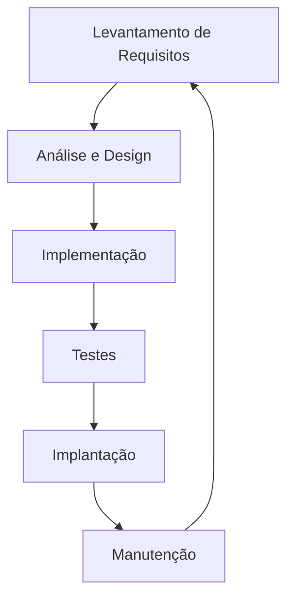

# Aula 01 – Fundamentos da Engenharia de Software

## 🎯 Objetivos de Aprendizagem
- Compreender o que é Engenharia de Software e sua importância.
- Diferenciar "programação" (coding) de "engenharia de software".
- Conhecer o Ciclo de Vida de Desenvolvimento de Software (SDLC).
- Entender as fases fundamentais da construção de um software.

## 📚 Conteúdo

### 1. O que é Engenharia de Software?
Engenharia de Software é a aplicação de uma abordagem sistemática, disciplinada e quantificável para o desenvolvimento, operação e manutenção de software. Diferente de apenas escrever código, ela se preocupa com:
- **Qualidade**: O software funciona como esperado? É seguro?
- **Prazo e Custo**: O projeto será entregue no tempo e orçamento previstos?
- **Manutenibilidade**: O código pode ser entendido e alterado por outras pessoas no futuro?

#### Métrica de Exemplo (Estimativa de Esforço):
No modelo COCOMO básico, o esforço $E$ em pessoas-mês é calculado como:
$$ E = a \cdot (KLOC)^b $$
Onde $KLOC$ é a quantidade de linhas de código em milhares.

> "Software Engineering is programming integrated over time." — Titus Winters (Google)

### 2. A Crise do Software e a Necessidade de Processos
Historicamente, muitos projetos de software falhavam (estouravam prazos, orçamentos ou não funcionavam). Isso levou à **Crise do Software**, que impulsionou a criação de métodos para organizar o trabalho.

### 3. O Ciclo de Vida de Desenvolvimento de Software (SDLC)
O SDLC (Software Development Life Cycle) é a estrutura que define as etapas envolvidas na criação de um software.

As fases clássicas são:

1.  **Levantamento de Requisitos**: Entender O QUE deve ser construído (ex: "O usuário precisa fazer login").
2.  **Análise e Design**: Planejar COMO será construído (ex: "Usaremos um banco de dados SQL e uma interface web").
3.  **Implementação (Codificação)**: Escrever o código de fato.
4.  **Testes (Verificação)**: Garantir que não há erros (bugs).
5.  **Implantação (Deploy)**: Colocar o software no ar para o usuário.
6.  **Manutenção**: Corrigir problemas e adicionar novas funcionalidades após o lançamento.

### 4. Analogia: Construindo uma Casa
- **Requisitos**: Conversar com o arquiteto sobre quantos quartos a casa terá.
- **Design**: Desenhar a planta baixa e escolher os materiais.
- **Implementação**: Pedreiros levantando paredes e instalando encanamento.
- **Testes**: Verificar se as luzes acendem e se não há vazamentos.
- **Implantação**: Entregar as chaves ao dono.
- **Manutenção**: Pintar paredes descascadas ou consertar uma telha quebrada anos depois.

---

---

## 📅 Atividades

- [ ] **[Ver Slides da Aula](../slides/slide-01.html)**
- [ ] **[Fazer Quiz](../quizzes/quiz-01.md)**
- [ ] **[Praticar Exercícios](../exercicios/exercicio-01.md)**
- [ ] **[Realizar Projeto](../projetos/projeto-01.md)**
