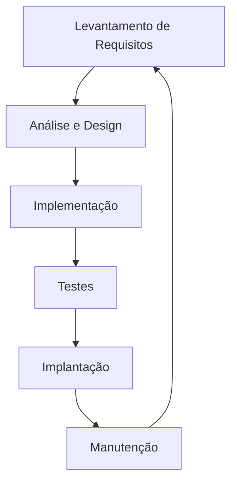

# Aula 01 – Fundamentos da Engenharia de Software

## 🎯 Objetivos de Aprendizagem
- Compreender o que é Engenharia de Software e sua importância.
- Diferenciar "programação" (coding) de "engenharia de software".
- Conhecer o Ciclo de Vida de Desenvolvimento de Software (SDLC).
- Entender as fases fundamentais da construção de um software.

## 📚 Conteúdo

### 1. O que é Engenharia de Software?

!!! info "Conceito Chave"
    Engenharia de Software é a aplicação de uma abordagem **sistemática**, **disciplinada** e **quantificável** para o desenvolvimento, operação e manutenção de software.

Diferente de apenas escrever código (programação), a engenharia se preocupa com o ciclo completo e o impacto a longo prazo:

-   **Qualidade**: O software funciona como esperado? É seguro?
-   **Prazo e Custo**: O projeto será entregue no tempo e orçamento previstos?
-   **Manutenibilidade**: O código pode ser entendido e alterado por outras pessoas no futuro?

> [!TIP]
> Engenharia de Software é como a aviação: existem protocolos para garantir que nada caia por uma falha boba.

#### 📊 Métrica de Exemplo (Estimativa de Esforço):
No modelo COCOMO básico, o esforço $E$ em pessoas-mês é calculado como:
$$ E = a \cdot (KLOC)^b $$
Onde $KLOC$ é a quantidade de linhas de código em milhares.

---

### 2. A Crise do Software
Historicamente, muitos projetos de software falhavam (estouravam prazos, orçamentos ou não funcionavam). Isso levou à **Crise do Software**, que impulsionou a criação de métodos para organizar o trabalho.

!!! warning "Atenção"
    Não subestime a complexidade. Software é invisível, o que torna erros difíceis de detectar sem um processo sólido.

---

### 3. O Ciclo de Vida de Desenvolvimento de Software (SDLC)

O SDLC (Software Development Life Cycle) é a estrutura que define as etapas envolvidas na criação de um software.



!!! tip "Dica Didática"
    Pense no SDLC como uma receita de bolo: você não começa a assar sem antes comprar os ingredientes (requisitos) e pré-aquecer o forno (preparação).

---

### 4. Exemplos Práticos (TermynalJS)

<div class="termy" markdown>
```bash
$ git init projeto-software
$ echo "planejamento" > requisitos.txt
$ # Simulação de ciclo de vida
$ ls -R
```
</div>

---

## 📝 Exercícios Progressivos

1.  **[Básico]** Defina com suas palavras a diferença entre um programador e um engenheiro de software.
2.  **[Básico]** Cite as 6 fases principais do SDLC.
3.  **[Intermediário]** Por que a fase de manutenção é frequentemente a mais cara de todo o ciclo?
4.  **[Intermediário]** Explique o que foi a "Crise do Software".
5.  **[Desafio]** Pesquise sobre o modelo COCOMO e explique por que estimar o tamanho do software em linhas de código (KLOC) pode ser problemático.

---

## 🚀 Mini-Projeto 01: O Primeiro Roadmap
Crie um documento simples listando os **Requisitos** para um sistema de "Gestão de Biblioteca". O que um usuário (estudante) e um administrador (bibliotecário) precisariam fazer no sistema?

---

## 📅 Atividades

- [ ] :material-presentation: **[Ver Slides da Aula](../slides/slide-01.html)**
- [ ] :material-school: **[Fazer Quiz](../quizzes/quiz-01.md)**
- [ ] :material-dumbbell: **[Praticar Exercícios](../exercicios/exercicio-01.md)**
- [ ] :material-rocket: **[Realizar Projeto](../projetos/projeto-01.md)**
