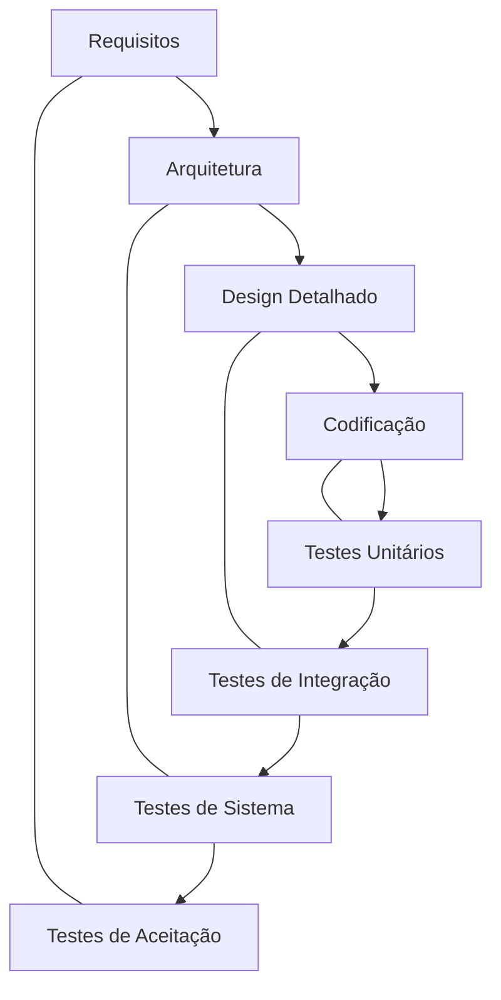

# Aula 02 – Processos de Software: Cascata e Ágil

## 🎯 Objetivos de Aprendizagem
- Entender a evolução dos modelos de processo de software.
- Conhecer o modelo Cascata (Waterfall) e suas limitações.
- Introduzir o conceito de Desenvolvimento Ágil.
- Comparar abordagens tradicionais vs. ágeis.

## 📚 Conteúdo

### 1. O Modelo Cascata (Waterfall)
O modelo tradicional e sequencial. Nele, cada fase do ciclo de vida deve ser finalizada antes da próxima começar.

!!! info "Definição"
    O Cascata é um modelo linear onde as etapas fluem para baixo, como uma queda d'água.

-   **Fluxo**: Requisitos :material-arrow-right: Design :material-arrow-right: Código :material-arrow-right: Testes :material-arrow-right: Deploy.
-   **Vantagem**: Fácil de gerenciar e entender o progresso.
-   **Problema**: Rígido. Mudar requisitos no meio do projeto é extremamente caro.

---

### 2. O Modelo V (V-Model)
Uma evolução do Cascata que coloca o foco na **Verificação e Validação**.



!!! warning "Atenção"
    No Modelo V, para cada fase de construção, existe um plano de teste correspondente desde o início.

---

### 3. O Manifesto Ágil
Devido à frustração com projetos lentos e burocráticos, surgiu o movimento Ágil.

!!! tip "Os 4 Pilares"
    1.  **Pessoas e Interações** > Processos e Ferramentas.
    2.  **Software Funcional** > Documentação Extensa.
    3.  **Colaboração com o Cliente** > Negociação de Contratos.
    4.  **Responder a mudanças** > Seguir um plano fixo.

---

### 4. Demonstração de Agilidade (TermynalJS)

<div class="termy" markdown>
```bash
$ # Ciclo Ágil: Feedback Rápido
$ npm start --dev
$ # Alteração detectada... Reloading!
$ # Teste automatizado concluído: 100% OK
$ git commit -m "feat: entrega incremental da sprint 1"
```
</div>

---

## 📝 Exercícios Progressivos

1.  **[Básico]** Por que o modelo Cascata é chamado de "sequencial"?
2.  **[Básico]** Liste os 4 valores principais do Manifesto Ágil.
3.  **[Intermediário]** Qual a principal diferença entre o Modelo Cascata e o Modelo V?
4.  **[Intermediário]** Em qual cenário o Modelo Cascata ainda pode ser útil hoje em dia?
5.  **[Desafio]** Como a "Lei de Murphy" se aplica a projetos que utilizam apenas o modelo Cascata?

---

## 🚀 Mini-Projeto 02: O Comparativo
Crie uma tabela comparando "Construir uma Ponte" com "Construir um Aplicativo de Entregas". Qual desses projetos combina melhor com Cascata e qual combina melhor com Agile? Justifique.

---

## 📅 Atividades

- [ ] :material-presentation: **[Ver Slides da Aula](../slides/slide-02.html)**
- [ ] :material-school: **[Fazer Quiz](../quizzes/quiz-02.md)**
- [ ] :material-dumbbell: **[Praticar Exercícios](../exercicios/exercicio-02.md)**
- [ ] :material-rocket: **[Realizar Projeto](../projetos/projeto-02.md)**
