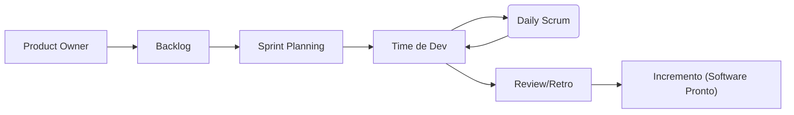

# Aula 03 – Metodologias Ágeis: Scrum e Kanban

## 🎯 Objetivos de Aprendizagem
- Aprofundar o conhecimento em metodologias Ágeis.
- Entender o framework Scrum (Papéis, Artefatos, Eventos).
- Entender o método Kanban (Visualização e fluxo).
- Diferenciar Scrum de Kanban.

## 📚 Conteúdo

### 1. Scrum: O Time em Campo
Scrum é o framework ágil mais utilizado no mundo. Ele transforma o trabalho em ciclos iterativos.

!!! info "O que é uma Sprint?"
    A **Sprint** é o coração do Scrum. É um período de tempo fixo (geralmente de 1 a 4 semanas) onde um incremento de software "Pronto" é criado.

#### 📊 Papéis e Fluxo


#### Artefatos
1.  **Product Backlog**: Lista de desejos do cliente.
2.  **Sprint Backlog**: O que faremos agora.
3.  **Incremento**: O resultado final da Sprint.

---

### 2. Kanban: Visualizando o Fluxo
Diferente do Scrum, o Kanban não tem ciclos fixos; ele foca no fluxo contínuo.

!!! tip "O Quadro Kanban"
    A regra de ouro do Kanban é **Limitar o Trabalho em Progresso (WIP)**. Não comece novas tarefas antes de terminar as atuais!

-   **To-Do**: Pendente.
-   **Doing**: Em desenvolvimento.
-   **Done**: Entregue.

---

### 3. Simulação de Trabalho Ágil (TermynalJS)

<div class="termy" markdown>
```bash
$ # Status da Sprint
$ scrum status
$ # Tarefas no Scrum Backlog: 12
$ # Tarefas Concluídas: 5
$ # Movendo tarefa de 'Doing' para 'Done'
$ kanban move task-102 --to done
```
</div>

!!! warning "Importante"
    Scrum é focado em **tempo** (concluir a Sprint), enquanto Kanban é focado em **fluxo** (entregar tarefas continuamente).

---

## 📝 Exercícios Progressivos

1.  **[Básico]** O que é uma "Sprint" no Scrum?
2.  **[Básico]** No Kanban, o que significa a sigla WIP (Work In Progress)?
3.  **[Intermediário]** Qual o papel do Scrum Master e em que ele difere de um "Chefe"?
4.  **[Intermediário]** Explique a diferença entre a Sprint Review e a Sprint Retrospective.
5.  **[Desafio]** Um time está sofrendo com muitas interrupções externas durante a Sprint. Qual metodologia você recomendaria para ajudar a visualizar esse problema e por quê?

---

## 🚀 Mini-Projeto 03: O Quadro Kanban
Utilize uma ferramenta (ou papel) para montar um Quadro Kanban para a organização dos seus estudos. Crie pelo menos 5 tarefas e defina um limite de WIP para a coluna "Fazendo".

---

## 📅 Atividades

- [ ] :material-presentation: **[Ver Slides da Aula](../slides/slide-03.html)**
- [ ] :material-school: **[Fazer Quiz](../quizzes/quiz-03.md)**
- [ ] :material-dumbbell: **[Praticar Exercícios](../exercicios/exercicio-03.md)**
- [ ] :material-rocket: **[Realizar Projeto](../projetos/projeto-03.md)**
