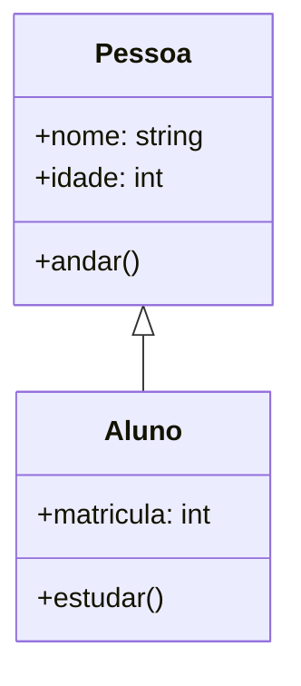

# Aula 05 – Modelagem de Sistemas e UML

## 🎯 Objetivos de Aprendizagem
- Entender o que é Modelagem de Software.
- Conhecer a UML (Unified Modeling Language).
- Aprender a ler Diagramas de Caso de Uso.
- Aprender a ler Diagramas de Classes básicos.

## 📚 Conteúdo

### 1. Por que modelar?
Assim como arquitetos desenham plantas antes de construir, engenheiros de software criam modelos para:
- Visualizar o sistema antes de codificar.
- Comunicar ideias com o time.
- Encontrar erros de lógica cedo.

### 2. O que é UML?
UML (Linguagem de Modelagem Unificada) é o padrão mundial para desenhar diagramas de software. Não é uma linguagem de programação, é uma linguagem visual.

### 3. Diagrama de Caso de Uso (O "O Quê" e "Quem")
Mostra as interações entre usuários (Atores) e o sistema (Casos de Uso).

- **Ator (Boneco palito)**: Quem usa o sistema (ex: Cliente, Admin).
- **Caso de Uso (Elipse)**: Uma funcionalidade (ex: "Fazer Login", "Comprar Produto").
- **Linha**: Conecta quem faz o quê.

*Exemplo*: Um boneco "Cliente" ligado a uma elipse "Realizar Pedido".

### 4. Diagrama de Classes (A Estrutura)
Mostra a estrutura estática do sistema: as "coisas" que existem nele e seus relacionamentos.

- **Classe (Retângulo)**: Representa um conceito (ex: `Carro`).
- **Atributos**: O que a classe tem (ex: `cor`, `modelo`).
- **Métodos**: O que a classe faz (ex: `acelerar()`, `frear()`).

*Exemplo*:

*(Nota: O diagrama acima mostra que Aluno é um tipo de Pessoa - Herança).*

---

## 📽 Roteiro de Slides
- **Slide 1**: Modelagem de Sistemas e UML.
- **Slide 2**: A importância de desenhar antes de codificar.
- **Slide 3**: O que é UML? (Padrão visual).
- **Slide 4**: Diagrama de Caso de Uso (Atores e Funcionalidades).
- **Slide 5**: Exemplo visual de Caso de Uso.
- **Slide 6**: Diagrama de Classe (Retângulos, Atributos, Métodos).
- **Slide 7**: Exemplo visual de Classe.

---

## 📝 Quiz

**1. O que significa UML?**
A) Ultramodern Modeling Language
B) Unified Modeling Language (Linguagem de Modelagem Unificada)
C) Universal Machine Language
D) User Management Logistic

**2. No Diagrama de Caso de Uso, o que o "boneco palito" representa?**
A) Um erro no sistema.
B) O banco de dados.
C) Um Ator (quem interage com o sistema).
D) O gerente do projeto.

**3. Qual diagrama mostra a estrutura estática (classes e atributos) do sistema?**
A) Diagrama de Caso de Uso.
B) Diagrama de Classes.
C) Diagrama de Sequência.
D) Fluxograma.

**4. Para que serve a modelagem de software?**
A) Para deixar o escritório mais bonito com desenhos.
B) Para visualizar, comunicar e documentar o sistema antes de programar.
C) Para substituir o código final.
D) Para tornar o software mais lento.

**5. Em um diagrama de classes, o que são os "Métodos"?**
A) As características da classe (ex: cor).
B) As ações ou comportamentos da classe (ex: andar).
C) O nome da classe.
D) As conexões.

**Gabarito:**
1-B, 2-C, 3-B, 4-B, 5-B

---

## 🛠 Exercícios
1.  **Observação**: Olhe para o seu celular. Se o "Celular" fosse uma Classe, cite 3 atributos (o que ele tem) e 3 métodos (o que ele faz).
2.  **Caso de Uso**: Desenhe (no papel) um diagrama de Caso de Uso simples para um "Caixa Eletrônico". Atores: Cliente e Técnico. Casos de uso: Sacar Dinheiro, Depositar, Repor Dinheiro.
3.  **Leitura**: Se você ver uma seta conectando a classe `Cachorro` à classe `Animal`, o que isso provavelmente significa? (Dica: Herança).

---

## 🚀 Projeto da Aula: Modelando o App
**Atividade da Aula:**
Vamos criar modelos simples para o To-Do App.

1.  **Diagrama de Caso de Uso**:
    - Identifique os Atores (ex: Usuário Comum, talvez? Admin?).
    - Desenhe (ou liste) os Casos de Uso ligados a eles (ex: Criar Tarefa, Completar Tarefa).
2.  **Diagrama de Classes (Conceitual)**:
    - Pense na principal "coisa" do seu app: a `Tarefa`.
    - Quais atributos ela tem? (Título, Descrição, Data, EstáConcluída?).
    - Quais métodos ela poderia ter? (Concluir(), Editar(), Adiar()?).
3.  **Ferramenta**: Use papel e caneta, ou ferramentas online como Draw.io ou Mermaid.live.
