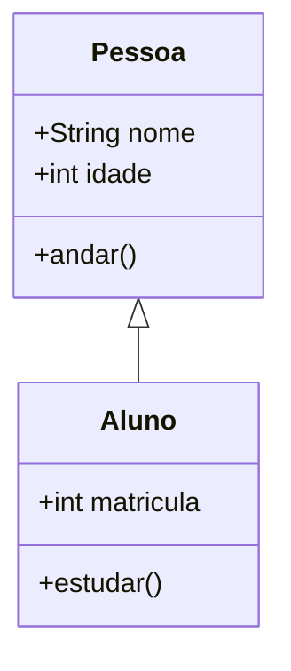

# Aula 05 – Modelagem de Sistemas e UML

## 🎯 Objetivos de Aprendizagem
- Entender o que é Modelagem de Software.
- Conhecer a UML (Unified Modeling Language).
- Aprender a ler Diagramas de Caso de Uso.
- Aprender a ler Diagramas de Classes básicos.

## 📚 Conteúdo

### 1. Por que modelar?
Assim como arquitetos desenham plantas antes de construir, engenheiros de software criam modelos para:
- Visualizar o sistema antes de codificar.
- Comunicar ideias com o time.
- Encontrar erros de lógica cedo.

### 2. O que é UML?
UML (Linguagem de Modelagem Unificada) é o padrão mundial para desenhar diagramas de software. Não é uma linguagem de programação, é uma linguagem visual.

### 3. Diagrama de Caso de Uso (O "O Quê" e "Quem")
Mostra as interações entre usuários (Atores) e o sistema (Casos de Uso).

- **Ator (Boneco palito)**: Quem usa o sistema (ex: Cliente, Admin).
- **Caso de Uso (Elipse)**: Uma funcionalidade (ex: "Fazer Login", "Comprar Produto").
- **Linha**: Conecta quem faz o quê.

*Exemplo*: Um boneco "Cliente" ligado a uma elipse "Realizar Pedido".

### 4. Diagrama de Classes (A Estrutura)
Mostra a estrutura estática do sistema: as "coisas" que existem nele e seus relacionamentos.

- **Classe (Retângulo)**: Representa um conceito (ex: `Carro`).
- **Atributos**: O que a classe tem (ex: `cor`, `modelo`).
- **Métodos**: O que a classe faz (ex: `acelerar()`, `frear()`).

*Exemplo*:

*(Nota: O diagrama acima mostra que Aluno é um tipo de Pessoa - Herança).*

---

---

## 📅 Atividades

- [ ] **[Ver Slides da Aula](../slides/slide-05.html)**
- [ ] **[Fazer Quiz](../quizzes/quiz-05.md)**
- [ ] **[Praticar Exercícios](../exercicios/exercicio-05.md)**
- [ ] **[Realizar Projeto](../projetos/projeto-05.md)**
