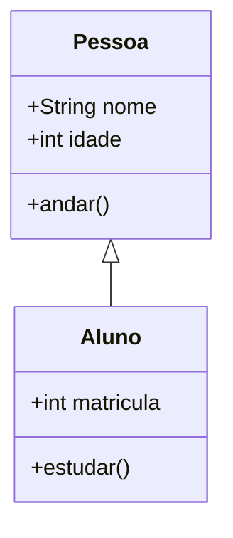

# Aula 05 – Modelagem de Sistemas e UML

## 🎯 Objetivos de Aprendizagem
- Entender o que é Modelagem de Software.
- Conhecer a UML (Unified Modeling Language).
- Aprender a ler Diagramas de Caso de Uso e de Classes.

## 📚 Conteúdo

### 1. Por que modelar?
Assim como arquitetos desenham plantas antes de construir, engenheiros de software criam modelos para visualizar a solução antes da codificação.

!!! info "Comunicação Visual"
    Diagramas ajudam a alinhar o entendimento entre o cliente (entidade de negócios) e o desenvolvedor (entidade técnica).

---

### 2. O que é UML?
A UML (Linguagem de Modelagem Unificada) é o padrão visual para documentar a arquitetura e o comportamento de sistemas orientados a objetos.

---

### 3. Diagrama de Caso de Uso
Foca no **"O que"** o sistema faz e **"Quem"** interage com ele.

!!! tip "Elementos Básicos"
    - **Atores**: Bonecos palito representam usuários ou sistemas externos.
    - **Casos de Uso**: Elipses representam as funcionalidades.

<div class="termy" markdown>
```text
$ # Fluxo de Caso de Uso: Comprar Produto
$ # 1. Ator seleciona item
$ # 2. Sistema valida estoque
$ # 3. Sistema processa pagamento
```
</div>

---

### 4. Diagrama de Classes
Mostra a estrutura estática do sistema (os dados e comportamentos).



!!! warning "Sintaxe Mermaid"
    Note que usamos `+String nome` em vez de `+nome: String` para garantir compatibilidade máxima com diferentes renderizadores.

---

## 📝 Exercícios Progressivos

1.  **[Básico]** O que significa a sigla UML?
2.  **[Básico]** Qual a diferença entre um "Ator" e um "Usuário" em UML?
3.  **[Intermediário]** No diagrama de classes, o que representa o símbolo `+` antes de um atributo?
4.  **[Intermediário]** Desenhe (em papel) um pequeno Diagrama de Caso de Uso para um "Sistema de Caixa Eletrônico" (Saque, Consulta de Saldo).
5.  **[Desafio]** No exemplo de Mermaid acima, o que significa a seta `<|--`? (Pesquise sobre Herança se necessário).

---

## 🚀 Mini-Projeto 05: Modelando o Mundo Real
Crie um Diagrama de Classes simples para um "Sistema de E-commerce". Defina as classes `Produto`, `Cliente` e `Pedido`. Liste pelo menos 2 atributos e 1 método para cada uma.

---

## 📅 Atividades

- [ ] :material-presentation: **[Ver Slides da Aula](../slides/slide-05.html)**
- [ ] :material-school: **[Fazer Quiz](../quizzes/quiz-05.md)**
- [ ] :material-dumbbell: **[Praticar Exercícios](../exercicios/exercicio-05.md)**
- [ ] :material-rocket: **[Realizar Projeto](../projetos/projeto-05.md)**
