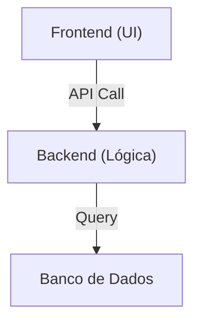

# Aula 06 – Arquitetura de Software

## 🎯 Objetivos de Aprendizagem
- Entender o conceito de Arquitetura de Software.
- Conhecer padrões arquiteturais comuns (Monólito, Microserviços).
- Entender a separação Frontend vs. Backend.

## 📚 Conteúdo

### 1. O que é Arquitetura?
Se a modelagem (Aula 05) é a planta baixa da casa, a Arquitetura é a estrutura e engenharia por trás. Define a organização fundamental do sistema e as decisões difíceis de mudar.

!!! info "Decisão Estratégica"
    Arquitetura de software é o conjunto de decisões técnicas significativas sobre a estrutura de um sistema e seus componentes.

---

### 2. Monólito vs. Microserviços

#### A) Monólito (Tudo em um só lugar)
O sistema inteiro é construído como uma única unidade.

!!! tip "Vantagens"
    - Mais simples de desenvolver inicialmente.
    - Testes e deploys mais diretos.
    - Ideal para times pequenos.

#### B) Microserviços (Dividir para conquistar)
O sistema é composto por pequenos serviços independentes que se comunicam via rede (APIs).

!!! warning "Atenção"
    Embora escalável, microserviços introduzem uma complexidade enorme de rede e gerenciamento (ex: Docker, Kubernetes).

---

### 3. Padrão Multicamadas (Layered)
A forma mais clássica de organizar o código internamente:

1.  **Apresentação (UI)**: Interface com o usuário.
2.  **Negócio (BLL)**: Onde as regras "mandam".
3.  **Dados (DAL)**: Acesso ao banco de dados.



---

### 4. Simulação de Arquitetura (TermynalJS)

<div class="termy" markdown>
```bash
$ # Verificando serviços ativos (Microserviços)
$ docker ps
$ # Service-Catalog: UP (Port 8081)
$ # Service-Checkout: UP (Port 8082)
$ # Service-Payment:  DOWN (Port 8083)
$ # Alerta: Checkout não funcionará sem o Payment!
```
</div>

---

## 📝 Exercícios Progressivos

1.  **[Básico]** O que é Arquitetura de Software?
2.  **[Básico]** Diferencie Frontend de Backend.
3.  **[Intermediário]** Cite uma vantagem e uma desvantagem de usar Microserviços.
4.  **[Intermediário]** Por que dizemos que decisões arquiteturais são "caras"?
5.  **[Desafio]** Uma startup quer lançar um MVP (Produto Mínimo Viável) em 2 meses com um time de 3 pessoas. Você recomendaria Monólito ou Microserviços? Justifique.

---

## 🚀 Mini-Projeto 06: Planejando a Estrutura
Desenhe (ou descreva) quais seriam as "camadas" de um sistema de Login. O que aconteceria na camada de Interface, na camada de Lógica e na camada de Banco de Dados?

---

## 📅 Atividades

- [ ] :material-presentation: **[Ver Slides da Aula](../slides/slide-06.html)**
- [ ] :material-school: **[Fazer Quiz](../quizzes/quiz-06.md)**
- [ ] :material-dumbbell: **[Praticar Exercícios](../exercicios/exercicio-06.md)**
- [ ] :material-rocket: **[Realizar Projeto](../projetos/projeto-06.md)**
