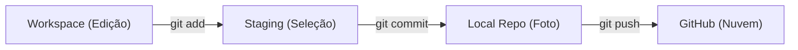

# Aula 07 – Versionamento de Código (Git & GitHub)

## 🎯 Objetivos de Aprendizagem
- Entender para que serve o Versionamento de Código.
- Conhecer o Git (ferramenta) e o GitHub (plataforma).
- Aprender os comandos básicos: `init`, `add`, `commit`, `push`.
- Entender o conceito de Branches (Ramos).

## 📚 Conteúdo

### 1. O Problema das Versões
Sem versionamento, os arquivos ficam desorganizados e é impossível saber quem mudou o quê. No desenvolvimento de software, precisamos de uma **Máquina do Tempo**.

!!! info "Por que usar Git?"
    O Git resolve o problema do "final_final_v2.zip". Ele permite salvar estados do código e alternar entre eles com segurança.

---

### 2. Git vs. GitHub
Não confunda a ferramenta com o serviço!

-   **Git**: O motor. É um software que você instala no seu computador para controlar as versões localmente.
-   **GitHub**: O estacionamento. É uma plataforma na nuvem onde você guarda seus projetos e colabora com outros desenvolvedores.

---

### 3. O Fluxo de Trabalho (Ciclo de Vida)



!!! tip "Dica de Ouro"
    Pense no `git add` como colocar as compras no carrinho e no `git commit` como passar no caixa e finalizar a compra.

---

### 4. Praticando no Terminal (TermynalJS)

<div class="termy" markdown>
```bash
$ # Iniciando um novo projeto
$ git init
$ git add .
$ git commit -m "feat: estrutura inicial do curso"
$ # Conectando ao GitHub e enviando
$ git remote add origin https://github.com/usuario/projeto.git
$ git push origin main
```
</div>

!!! warning "Atenção"
    Sempre escreva mensagens de commit claras (ex: "fix: corrige erro no login") para que seus colegas entendam o que você fez.

---

## 📝 Exercícios Progressivos

1.  **[Básico]** Qual a diferença entre Git e GitHub?
2.  **[Básico]** Para que serve o comando `git add`?
3.  **[Intermediário]** O que acontece quando executamos um `git commit`?
4.  **[Intermediário]** Explique o conceito de "Branch" (Ramo) e por que ele é importante para trabalhar em equipe.
5.  **[Desafio]** Você descobriu um erro grave no código que foi enviado ontem. Como o Git pode te ajudar a voltar para a versão de anteontem? (Pesquise sobre `git checkout` ou `git revert`).

---

## 🚀 Mini-Projeto 07: Meu Primeiro Repo
Crie um repositório no seu GitHub chamado `estudos-eng-software`. Faça o commit de um arquivo `README.md` explicando o que você está aprendendo nesta aula e envie-o para a nuvem.

---

## 📅 Atividades

- [ ] :material-presentation: **[Ver Slides da Aula](../slides/slide-07.html)**
- [ ] :material-school: **[Fazer Quiz](../quizzes/quiz-07.md)**
- [ ] :material-dumbbell: **[Praticar Exercícios](../exercicios/exercicio-07.md)**
- [ ] :material-rocket: **[Realizar Projeto](../projetos/projeto-07.md)**
