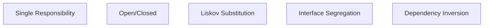

# Aula 08 – Design de Software e SOLID

## 🎯 Objetivos de Aprendizagem
- Entender os princípios de um bom design de software.
- Compreender os conceitos de Acoplamento e Coesão.
- Introduzir o princípio KISS e DRY.
- Conhecer os Princípios SOLID (visão geral).

## 📚 Conteúdo

### 1. Design de Software
Design não é apenas sobre cores e botões; em engenharia, é sobre a **organização interna** do código. Um bom design torna o software fácil de mudar e difícil de quebrar.

!!! info "O Código Espaguete"
    Sem design, o código se torna um amontoado confuso de funções dependentes. O objetivo do design é manter a ordem.

---

### 2. Conceitos Fundamentais

#### A) Coesão (O foco)
Cada parte do sistema deve fazer apenas uma coisa e fazê-la muito bem.

!!! tip "Alta Coesão"
    Imagine uma caixa de ferramentas. Cada ferramenta tem uma função única. Você não usa um martelo para parafusar.

#### B) Acoplamento (A dependência)
O quanto uma parte do sistema depende de outra. Queremos que as partes sejam independentes.

!!! warning "Baixo Acoplamento"
    Se você mudar o formato do banco de dados e precisar mexer em 50 arquivos diferentes, seu acoplamento está alto.

---

### 3. Princípios Práticos

-   **KISS (Keep It Simple, Stupid)**: Mantenha as coisas simples. Se há duas formas de resolver, escolha a mais óbvia.
-   **DRY (Don't Repeat Yourself)**: Não se repita. Se você copiou e colou código, você falhou no design.

---

### 4. SOLID (Os 5 Pilares)



<div class="termy" markdown>
```bash
$ # Analisando qualidade do design (Simulação)
$ analyze-design --file Pedido.js
$ # Alerta: Classe 'Pedido' faz muitas coisas! (Baixa Coesão)
$ # Sugestão: Separe a lógica de 'Cálculo de Desconto' em outra classe.
```
</div>

---

## 📝 Exercícios Progressivos

1.  **[Básico]** O que é "Coesão" em design de software?
2.  **[Básico]** O que significa a sigla DRY?
3.  **[Intermediário]** Por que um alto acoplamento é prejudicial para a manutenção?
4.  **[Intermediário]** Explique o princípio KISS com um exemplo do mundo real.
5.  **[Desafio]** Escolha DOIS princípios do SOLID e tente explicar a importância deles para um sistema que precisa crescer muito.

---

## 🚀 Mini-Projeto 08: Refatorando o Caos
Abaixo está um pseudo-código:
`função ProcessarPedido(id) { ValidarEstoque(); CobrarCartao(); EnviarEmailConfirmacao(); GerarNotaFiscal(); }`
Como você separaria essa função seguindo o princípio de **Responsabilidade Única (SRP)**?

---

## 📅 Atividades

- [ ] :material-presentation: **[Ver Slides da Aula](../slides/slide-08.html)**
- [ ] :material-school: **[Fazer Quiz](../quizzes/quiz-08.md)**
- [ ] :material-dumbbell: **[Praticar Exercícios](../exercicios/exercicio-08.md)**
- [ ] :material-rocket: **[Realizar Projeto](../projetos/projeto-08.md)**
