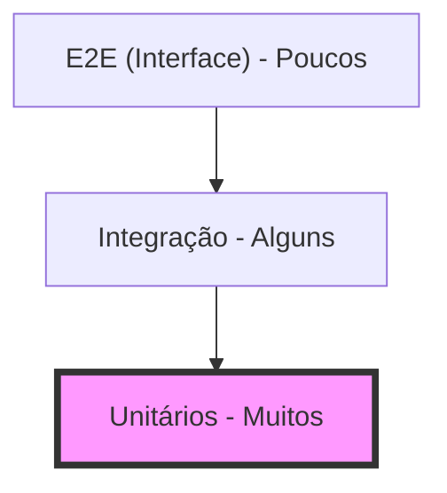

# Aula 10 – Testes de Software

## 🎯 Objetivos de Aprendizagem
- Entender a importância dos testes automatizados.
- Conhecer a Pirâmide de Testes.
- Diferenciar Testes Unitários de Integração e E2E.
- Introduzir o conceito de TDD (Test Driven Development).

## 📚 Conteúdo

### 1. Por que testar automaticamente?
Testar manualmente (clicar no botão todas as vezes que muda o código) é lento e propenso a erros. Testes automatizados são robôs que verificam seu código em milissegundos.

!!! info "Confiança para Mudar"
    Ter uma boa base de testes permite que você altere o código sem medo de quebrar algo que já funcionava (regressão).

---

### 2. A Pirâmide de Testes
Sugere o equilíbrio ideal entre velocidade e cobertura dos testes:



!!! tip "O Segredo da Pirâmide"
    A base (Unitários) deve ser grande porque são testes rápidos e baratos. O topo (E2E) deve ser pequeno porque são testes lentos e difíceis de manter.

---

### 3. Tipos de Teste

#### A) Teste Unitário
Testa a menor parte do código isoladamente (uma função).
-   *Ex*: "A função `calcularTotal(10, 5)` retorna `15`?"

#### B) Teste de Integração
Testa se duas ou mais peças funcionam bem juntas.
-   *Ex*: "A lógica do app consegue ler os dados do Banco de Dados?"

#### C) Teste End-to-End (E2E)
Testa o fluxo completo do usuário no navegador ou app.

---

### 4. TDD: Teste Primeiro, Código Depois
O TDD (Desenvolvimento Orientado a Testes) segue um ciclo repetitivo:

1.  **RED**: Escreva um teste que falha (o código ainda não existe).
2.  **GREEN**: Escreva o código mínimo para o teste passar.
3.  **REFACTOR**: Melhore o código garantindo que o teste continue passando.

<div class="termy" markdown>
```bash
$ # Executando testes unitários
$ npm test
$ # PASS  tests/math.test.js
$ # PASS  tests/auth.test.js
$ # Testes: 12 passed, 12 total
$ # Tempo: 0.5s
```
</div>

---

## 📝 Exercícios Progressivos

1.  **[Básico]** O que são testes automatizados?
2.  **[Básico]** Desenhe a Pirâmide de Testes e nomeie suas faces.
3.  **[Intermediário]** Qual a principal diferença entre um teste Unitário e um de Integração?
4.  **[Intermediário]** Explique as três fases do ciclo TDD (Red, Green, Refactor).
5.  **[Desafio]** Por que não devemos ter apenas testes de Interface (E2E) em um projeto grande?

---

## 🚀 Mini-Projeto 10: O Roteiro de Teste
Para uma funcionalidade de "Saque no Caixa Eletrônico", liste 3 testes unitários que você criaria (pense em valores válidos, valores negativos e saldo insuficiente).

---

## 📅 Atividades

- [ ] :material-presentation: **[Ver Slides da Aula](../slides/slide-10.html)**
- [ ] :material-school: **[Fazer Quiz](../quizzes/quiz-10.md)**
- [ ] :material-dumbbell: **[Praticar Exercícios](../exercicios/exercicio-10.md)**
- [ ] :material-rocket: **[Realizar Projeto](../projetos/projeto-10.md)**
