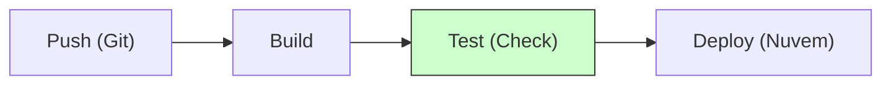

# Aula 11 – DevOps e CI/CD

## 🎯 Objetivos de Aprendizagem
- Entender o que é DevOps (Cultura).
- Compreender Integração Contínua (CI).
- Compreender Entrega Contínua (CD).
- Conhecer o conceito de Pipeline de Automação.

## 📚 Conteúdo

### 1. O fim do "No meu PC funciona"
Antigamente, desenvolvedores criavam o software e o "jogavam por cima do muro" para o time de Operações (infraestrutura) instalar. Isso gerava muitos conflitos.

!!! info "Cultura DevOps"
    DevOps não é uma ferramenta ou um cargo, é a união de **Dev**elopment (Desenvolvimento) e **Op**eration**s** (Operações). O objetivo é colaborar para entregar software rápido e com segurança.

---

### 2. CI/CD: A Esteira de Automação
Imagine uma fábrica de carros automatizada. Isso é o que chamamos de CI/CD em software.

#### CI (Continuous Integration)
Toda mudança é enviada para um repositório central e testada automaticamente.

!!! tip "Vantagem da CI"
    Descobrimos erros minutos após eles serem escritos, e não meses depois.

#### CD (Continuous Delivery / Deployment)
O código aprovado nos testes é preparado automaticamente para ir ao ar.

-   **Delivery**: O deploy é um passo manual (clicar em um botão).
-   **Deployment**: O deploy é 100% automático para os usuários.

---

### 3. O Pipeline (A jornada do código)



!!! warning "Stop the Line"
    Se o passo de **Test** falhar, o Pipeline para imediatamente e o código não vai para o ar. Qualidade em primeiro lugar!

---

### 4. Simulação de Pipeline (TermynalJS)

<div class="termy" markdown>
```bash
$ git push origin main
$ # Iniciando Workflow CI...
$ # [STEP 1] Build: SUCCESS
$ # [STEP 2] Unit Tests: SUCCESS
$ # [STEP 3] Security Scan: SUCCESS
$ # [STEP 4] Deploying to Production...
$ # Done! Versão 1.2.0 está no ar. 🚀
```
</div>

---

## 📝 Exercícios Progressivos

1.  **[Básico]** O que significa a sigla DevOps?
2.  **[Básico]** Qual a diferença entre Integração Contínua (CI) e Entrega Contínua (CD)?
3.  **[Intermediário]** Por que dizemos que DevOps é uma "cultura" e não apenas um software?
4.  **[Intermediário]** Descreva os passos comuns de um Pipeline de automação.
5.  **[Desafio]** Como a automação de testes (Aula 10) ajuda na implementação de uma cultura DevOps?

---

## 🚀 Mini-Projeto 11: Desenhando a Esteira
Imagine que você é o líder técnico de um novo banco digital. Desenhe ou descreva quais seriam os passos obrigatórios do seu Pipeline de Deploy para garantir que nenhum bug de segurança chegue aos clientes.

---

## 📅 Atividades

- [ ] :material-presentation: **[Ver Slides da Aula](../slides/slide-11.html)**
- [ ] :material-school: **[Fazer Quiz](../quizzes/quiz-11.md)**
- [ ] :material-dumbbell: **[Praticar Exercícios](../exercicios/exercicio-11.md)**
- [ ] :material-rocket: **[Realizar Projeto](../projetos/projeto-11.md)**
