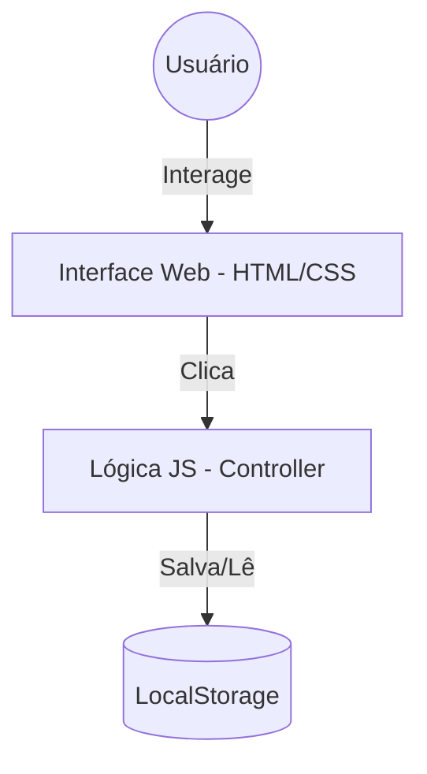

# Projeto 06 - Definição da Arquitetura

## 🎯 Objetivo
Escolher e documentar a arquitetura técnica do To-Do App.

## 📝 Descrição
Como estamos aprendendo conceitos, nosso projeto não precisa de servidores caros na nuvem. Vamos criar uma arquitetura que rode 100% no navegador do usuário.

## 🚀 Arquitetura Escolhida: Client-Side (Local)
Para este projeto educativo, usaremos uma arquitetura onde Front-end e "Back-end" rodam no mesmo lugar (o navegador).

- **Frontend (Interface)**: HTML5 e CSS3.
- **Lógica**: JavaScript.
- **Persistência (Dados)**: LocalStorage do navegador.

### Por que essa escolha?
1.  **Zero Custo**: Não precisa pagar servidor.
2.  **Simplicidade**: Focamos na lógica e no processo, não em configurar Linux/Docker agora.
3.  **Portabilidade**: Qualquer um com um navegador pode rodar.

## 🚀 Diagrama
Adicione este esquema ao seu projeto:

## 📤 Entrega
Adicione a seção "Arquitetura Técnica" ao seu documento de projeto com o diagrama acima (ou desenhado à mão).
